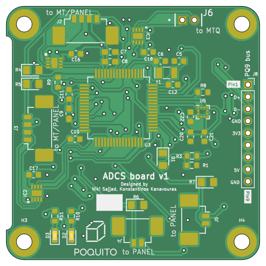

# POQUITO_ADCS

An ADCS PCB for a PocketQube, designed for the [QUBIK platform](https://libre.space/projects/qubik/).

This project is based on the https://gitlab.com/librespacefoundation/pq9ish/pq9ish-comms-vu-hw
project by the Libre Space Foundation, which was used for the [QUBIK](https://libre.space/projects/qubik/)
PocketQube missions.

## Features

- 3 magnetorquer drivers
- 1 9-axis Inertial Measurement Unit
- Based on an STM32L476 MCU
- Compatible with the [PQ9 standard](https://dataverse.nl/dataset.xhtml?persistentId=doi:10.34894/6MVBCZ)

## Images

## Related Projects

- [POQUITO Panels](https://github.com/kongr45gpen/POQUITO-panels)
